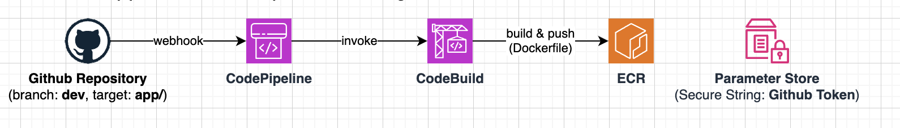
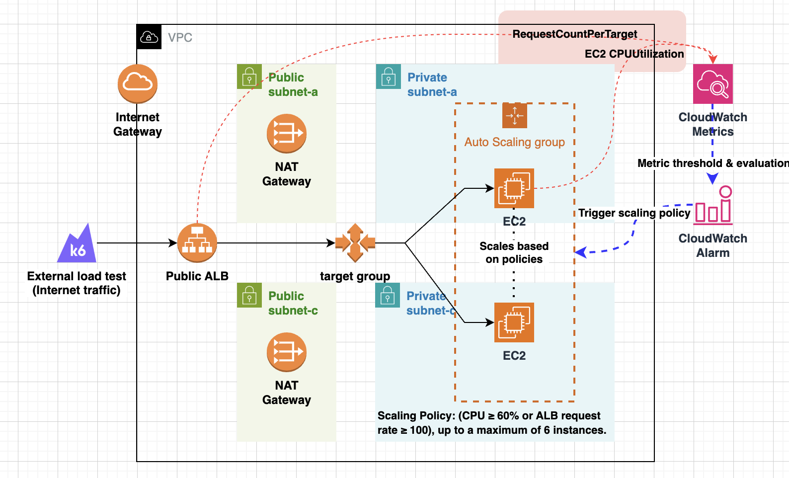
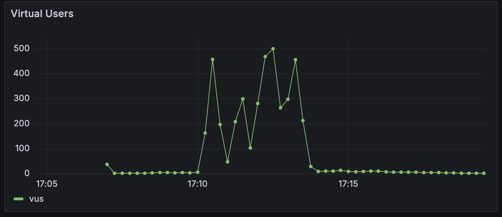

# Lab: Spike Load Scaling

Hands-on lab to simulate traffic spikes and observe how EC2 Auto Scaling behaves under real, measurable load.

## Overview

This lab explores how EC2 Auto Scaling responds to sudden traffic spikes.
The goal was to observe real scale-out behavior under sustained load, rather than relying on theoretical tuning.
Different instance launch strategies were compared to understand their impact on failure rate and latency.

## Continuous Integration

This CI pipeline exists to make the scale-out experiments reproducible.
The application is built into a Docker image and pushed to ECR for use during EC2 scale-out.

- Setup Guide - `will be added soon`
- [target-app](./apps/target-app/python)
- [infrastructure - terraform](./aws/00-ci-cd/)
- [Build Pipeline](./buildspec.yml)

## Scale-Out Performance Testing

Testing how different instance launch strategies affect scale-out speed during traffic spikes.

- Setup Guide - `will be added soon`
- [infrastructure - terraform](./aws/10-ec2-asg/)
- [performance testing - k6](./apps/load-generator/k6) - `will be added soon`

### Configuration

- **Instance Type**: t3.micro
- **Auto Scaling**: min 2, max 6, desired 2
- **Scaling Triggers**: CPU 60% or RPS 60
- **Warm Pool**: 2 instances (Stopped)
- **Load Testing**: k6 ramping-arrival-rate
  - 1m: 50 RPS (normal)
  - 1m: 120 RPS (triggers target tracking at 60 RPS/instance)
  - 4m: 200 RPS (triggers step scaling at 100 RPS/instance)
  - 1m: 300 RPS (peak spike at 150 RPS/instance)
  - 3m: 200 RPS (observe scale-out completion)
  - 2m: 50 RPS (cool down)

  Monitored with Grafana + Prometheus:

  

    
    
  

### Instance Launch Strategies Compared

Compared three different scaling approaches to measure scale-out performance:

1. **Baseline (User Data)**
   - Boot instance → Pull ECR image → Start application
   - Full cold start on every scale-out event

2. **AMI (Packer)**
   - Pre-built AMI with application image pre-pulled from ECR
   - Faster startup: Boot → Start application

3. **AMI + Warm Pool**
   - Pre-warmed instances ready in stopped state
   - Fastest response: Resume instance → Start application

### Results

| Approach | Failure Rate | P90 Latency | Dropped Iterations |
|----------|--------------|-------------|-------------------|
| Baseline | 7.89% | 53ms | 2.09% |
| AMI | 7.49% | 44ms | 2.59% |
| AMI + Warm Pool | 5.43% | 51ms | 0.55% |

> [!note]
> P90 latency was used instead of P95 because with 5%+ failure rates and 5-second timeout, P95 includes timeout-bound requests (~1000ms+) that don't reflect actual scale-out performance. P90 better represents successfully handled requests.

Optimizing instance launch strategy reduces the impact of traffic spikes, but does not fully eliminate failures caused by EC2 startup time. Warm Pool showed the most significant improvement with 5.43% failure rate and 0.55% dropped iterations—substantially better than Baseline (7.89% / 2.09%) and AMI (7.49% / 2.59%).

## Learnings

First time using AWS CodeBuild and CodePipeline beyond GitHub Actions. This experience helped me understand how to build a complete CI/CD pipeline within AWS ecosystem.

Working directly with EC2 Auto Scaling was eye-opening after primarily using container-based services (ECS/EKS). It revealed what happens beneath the abstraction layers of container orchestrators. I could directly observe how instance startup time, AMI optimization, and Warm Pool features impact scaling performance in practice.

VM-based scale-out has inherent limitations due to OS boot time.
Even with optimization, it responds more slowly than container-based orchestration systems.

## Future Work

### Continuous Integration
- Complete setup guide
- Integrate Packer for AMI creation

### Scale-Out Performance Testing
- Complete setup guide
- Additional metrics: scale-out time measurement, instance launch timing
- Load testing with database layer included
- Scaling tests on managed orchestration platforms (ECS/EKS)
- Different workload types (CPU, memory, I/O intensive)
- Automated testing infrastructure and scripts

### Continuous Deployment
- Automated AMI deployment to Auto Scaling Group
- Blue/Green deployment pipeline
